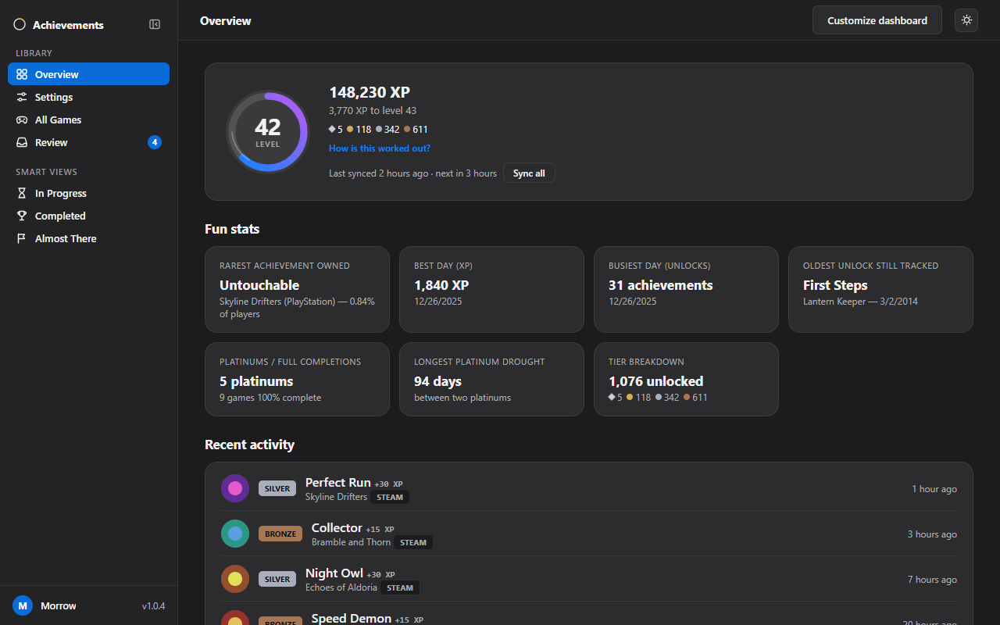
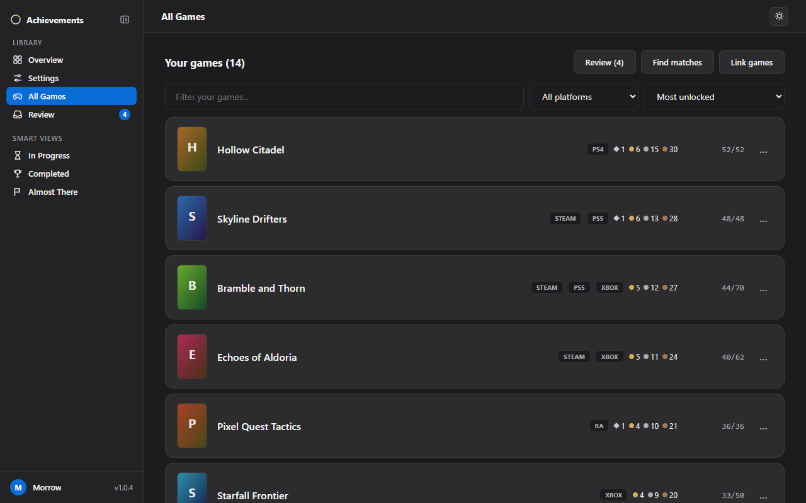
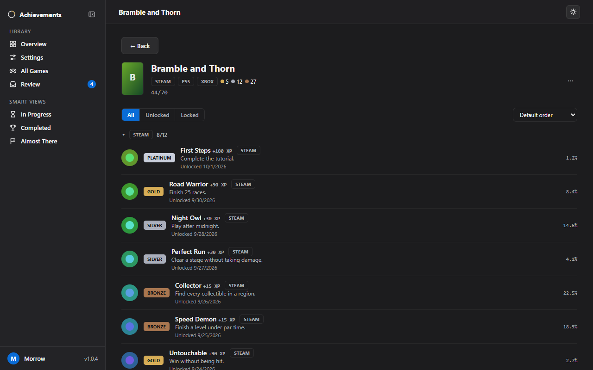
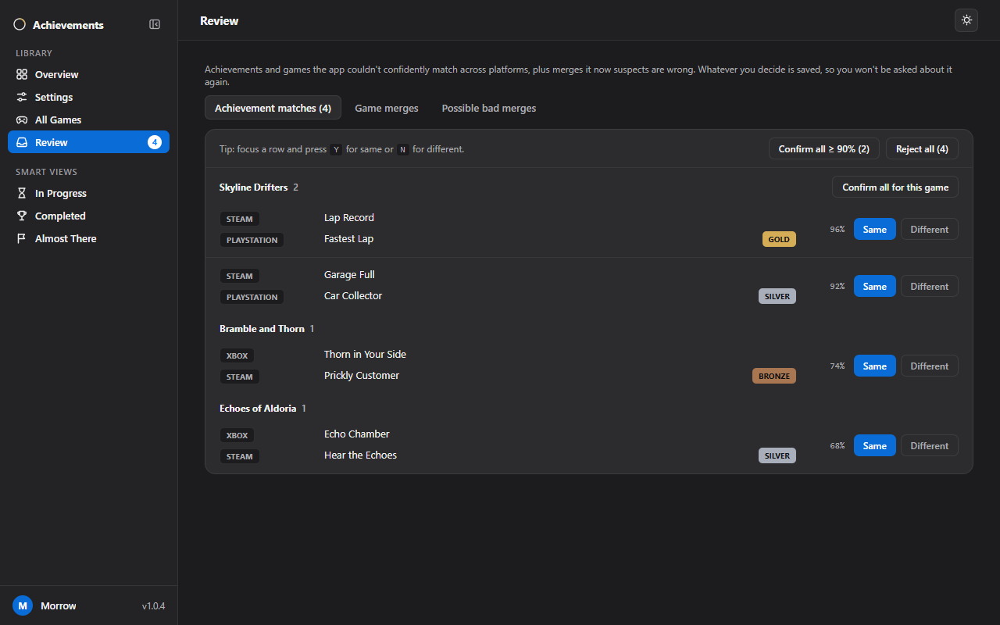

# Unified Achievement Manager

A Windows desktop app that pulls your Steam, Xbox, PlayStation, RetroAchievements, and GOG achievements into one place, with a unified score and level modeled on PlayStation's trophy system. Everything runs on your own computer. There's no server to set up, no account with us, and nothing leaves your PC except the requests to the platforms you connect.

- Every achievement gets a PSN-style tier (Bronze/Silver/Gold/Platinum). If a game exists on PlayStation, its native trophy tier wins, even for the Steam or Xbox version of the same achievement. Otherwise the tier comes from global unlock rarity.
- One combined score and level across all connected platforms, following a PSN-like leveling curve.
- A dashboard grouped per game and per platform, so multiple platinums or 100%s on the same game each show up.

> **Built with AI.** Unified Achievement Manager's code, tests and documentation were written by
> Claude, an AI model from Anthropic, directed and tested by the maintainer.
> See [AI disclosure](#ai-disclosure).

## Screenshots

The screenshots use made-up sample data.

## Install

1. Download `Unified-Achievement-Manager-Setup-<version>.exe` from the [Releases page](https://github.com/TheRealestNwah/unified-achievement-manager/releases).
2. Run it. It installs for your Windows user only and doesn't need administrator rights.
3. The installer isn't code-signed yet, so Windows SmartScreen may say it "protected your PC" from an unrecognized app. Click **More info**, then **Run anyway**.

Windows 10/11, 64-bit. The installer is about 135 MB because it bundles its own private copy of PostgreSQL, which only the app uses.

## First run

1. **Name your profile.** The app asks what to call you. That's your profile: there's no account to create and nothing to sign in to.
2. **Connect your platforms** under **Settings → Platforms**, as many or as few as you like. You don't need Steam.
3. Each platform syncs as soon as it's connected.

## Connecting platforms

- **Steam:** needs your own free Steam Web API key. Open [steamcommunity.com/dev/apikey](https://steamcommunity.com/dev/apikey), enter `localhost` as the domain name, and paste the key it gives you when the app asks. Steam's own sign-in page then opens inside the app to confirm which account is yours; the app never sees your password. The key also lets the app use Steam's public unlock rates to tier games you own on other platforms.
- **Xbox:** get a personal API key from [xbl.io/dashboard](https://xbl.io/dashboard) (sign in with your Microsoft account there first) and paste it in.
- **PlayStation:** log into [playstation.com](https://www.playstation.com) in your browser, then in the same browser visit https://ca.account.sony.com/api/v1/ssocookie and paste the `npsso` value it shows. Treat that token like a password, since it grants full account access.
- **RetroAchievements:** get a personal Web API key from your [account settings page](https://retroachievements.org/settings) and paste it in with your username.
- **GOG:** click **Log in at GOG**, sign in in your browser, then copy the `code` value out of the address GOG redirects you to and paste it in. Codes are single-use and expire quickly, so paste it straight away.

Links like these open in your normal web browser. Only Steam's sign-in page opens inside the app.

## Using it

- **Sync:** pulls each platform's library and unlocks and recomputes your score. While the app is open it also re-syncs every linked platform automatically, every 6 hours by default (change it or turn it off in **Settings → Background sync**). Turn on **Settings → Desktop app → Keep running in the tray** to keep that going after you close the window, and **Start with Windows** to have it start in the tray when you sign in. When a sync finds new achievements while the app isn't in front, a Windows notification says so (turn it off under **Settings → Desktop app → Unlock notifications**).
- **Find matches:** links the same real-world game and achievement across platforms so they share one tier, with PSN's own tier always winning. Your score isn't collapsed: unlocking the same achievement on two platforms still counts both.
- **Review:** high-confidence matches merge automatically. Anything uncertain (achievement matches, game merges, and possible bad merges) waits on the **Review** page in the sidebar, with a count of what's waiting, for you to confirm or reject.
- **Link games:** automatic matching only merges exact titles, so it misses cases like "Skyrim" on PSN vs "The Elder Scrolls V: Skyrim" on Steam. Click **Link games**, click the game whose title you want to keep, then click the duplicate.
- **Cover art and icons:** click a game's cover or an achievement's icon to paste an image URL or upload your own (PNG, JPEG, WebP, or GIF, up to 5 MB). Add a free SteamGridDB key under **Settings → API keys** to pick covers from SteamGridDB instead.
- **Rename, hide, or exclude a game:** right-click a game to change its display name, hide it from your library (it still counts toward your score), or exclude it (removed from your score too). Bring hidden and excluded games back from **Settings → Hidden games**.
- **Search acronyms:** typing an acronym in the games filter also finds its franchise ("GTA" finds Grand Theft Auto). Add your own under **Settings → Search acronyms**.
- **Discord:** while Discord is running, your level and XP show on your Discord profile. It's on by default; turn it off under **Settings → Discord**.
- **Updates:** the app checks for new versions in the background and asks before restarting to install one. **Check now** under **Settings → Desktop app** (or the tray menu) checks right away, and **Settings → Desktop app → Automatic updates** turns the background checks off.
- **Compact sidebar:** the button next to the app name collapses the sidebar to icons only. It collapses on its own when the window is narrow.
- **Export:** download every achievement in your library, with whether and when you unlocked it, as JSON or CSV from **Settings → Export**.
- **Disconnect:** any platform can be unlinked, which removes its synced games and achievements.
- **Delete profile:** permanently removes your profile and everything linked to it after you type `DELETE` to confirm. The app then starts over at first run.

## Your data

Everything is stored in `%APPDATA%\Unified Achievement Manager` (open it from **File → Open Data Folder**). Uninstalling keeps it, so reinstalling picks up where you left off. **File → Back Up…** and **File → Restore from Backup…** save it to, and restore it from, a single file. See [docs/operations.md](docs/operations.md) for backups, moving to a new PC, removing everything, and troubleshooting, and [docs/privacy.md](docs/privacy.md) for exactly what is stored and sent where.

## Status

See [ROADMAP.md](ROADMAP.md). Steam, Xbox, PSN, RetroAchievements, and GOG all work end to end.

## Development

See [docs/development.md](docs/development.md) for running from source, building the installer, the tests, and the HTTP API. How tiers, matching, and scoring work is in [docs/data-model.md](docs/data-model.md).

## AI disclosure

Unified Achievement Manager was built with [Claude Code](https://claude.com/claude-code), Anthropic's
AI coding assistant. Claude wrote the code, tests and documentation. The
maintainer ([@TheRealestNwah](https://github.com/TheRealestNwah)) decided what
it should do, tested it, and made the release decisions. Commits written with
Claude carry a `Co-Authored-By: Claude` trailer, so the git history shows which
changes were AI-written.

## Support

Everything on my GitHub is free of charge and open source. If you find it
useful and want to leave a tip or buy me a coffee, you can do that at
[ko-fi.com/morrowheat23](https://ko-fi.com/morrowheat23). It's appreciated,
never expected.

## License

MIT — see [LICENSE](LICENSE).

## macOS development preview

See [macOS build instructions and release gates](docs/macos.md). PR CI builds and smoke-tests Apple Silicon and Intel packages; no Mac release has been published.
